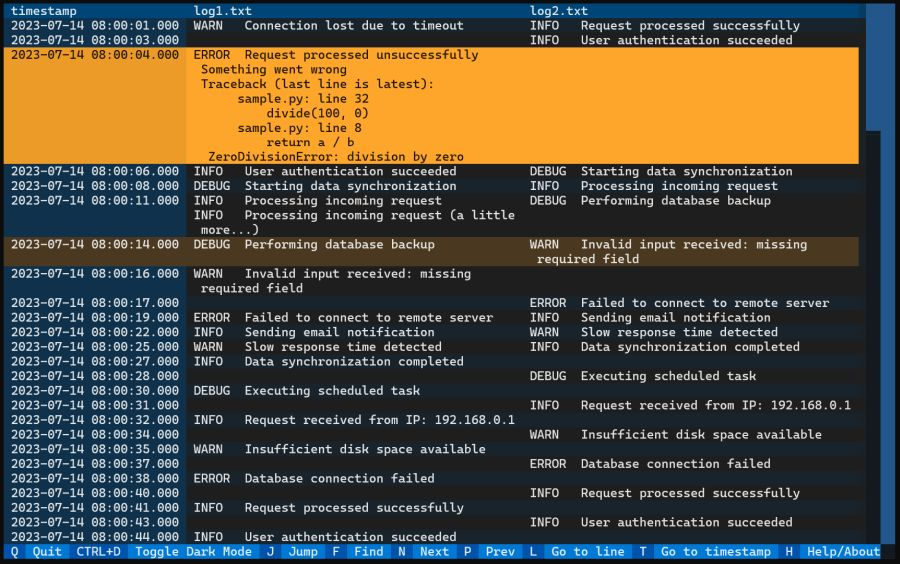

# log_merger

log_merger is a TUI for viewing a merged display of multiple log files, merged by timestamp.

Given these two log files:

```
# log1.txt
2023-07-14 08:00:01 WARN   Connection lost due to timeout
2023-07-14 08:00:04 ERROR  Request processed unsuccessfully
Something went wrong
Traceback (last line is latest):
    blah
    blah
ValueError("shouldn't have done that")
2023-07-14 08:00:06 INFO   User authentication succeeded
2023-07-14 08:00:08 DEBUG  Starting data synchronization
2023-07-14 08:00:11 INFO   Processing incoming request
```

```
# log2.txt
2023-07-14 08:00:01 INFO   Request processed successfully
2023-07-14 08:00:03 INFO   User authentication succeeded
2023-07-14 08:00:06 DEBUG  Starting data synchronization
2023-07-14 08:00:08 INFO   Processing incoming request
2023-07-14 08:00:11 DEBUG  Performing database backup
2023-07-14 08:00:14 WARN   Invalid input received: missing required field
```
This command

    log_merger log1.txt log2.txt

Shows the following merged display:
```
  Timestamp                 Log1.Txt                        Log2.Txt             
 ─────────────────────────────────────────────────────────────────────────────────────────
  2023-07-14 08:00:01.000   WARN   Connection lost due to   INFO   Request processed
                            timeout                         successfully
  2023-07-14 08:00:03.000                                   INFO   User authentication
                                                            succeeded
  2023-07-14 08:00:04.000   ERROR  Request processed
                            unsuccessfully
                            Something went wrong
                            Traceback (last line is
                            latest):
                                blah
                                blah
                            ValueError("shouldn't have
                            done that")
  2023-07-14 08:00:06.000   INFO   User authentication      DEBUG  Starting data
                            succeeded                       synchronization
  2023-07-14 08:00:08.000   DEBUG  Starting data            INFO   Processing incoming
                            synchronization                 request
  2023-07-14 08:00:11.000   INFO   Processing incoming      DEBUG  Performing database
                            request                         backup
                            INFO   Processing incoming
                            request (a little more...)
  2023-07-14 08:00:14.000   DEBUG  Performing database      WARN   Invalid input
                            backup                          received: missing required
                                                            field
```

Using the `-i` interactive option will display the merged log in an interactive terminal-based browser
(enabled using the [textual](https://textual.textualize.io) Python library).



## Command line arguments

`log_merger -h` will show the following help:

```
usage: log_merger [-h] [--interactive] [--start START] [--end END]
                  [--width WIDTH] [--line_numbers] [--csv CSV]
                  [--encoding ENCODING]
                  files [files ...]

positional arguments:
  files                 log files to be merged

options:
  -h, --help            show this help message and exit
  --interactive, -i     show output using interactive TUI browser
  --start START, -s START
                        start time to select time window for merging logs
  --end END, -e END     end time to select time window for merging logs
  --width WIDTH, -w WIDTH
                        total screen width to use for interactive mode (defaults to
                        current screen width)
  --line_numbers, -ln   add line number column
  --csv CSV, -csv CSV   save merged logs to CSV file
  --encoding ENCODING, -enc ENCODING
                        encoding to use when reading log files (defaults to the
                        system default encoding)
  --timestamp_format [TIMESTAMP_FORMATS ...]
                        custom timestamp format (regex-derived timestamp template)

Start and end timestamps to clip the given files to a particular time window can be
given in `YYYY-MM-DD HH:MM:SS.SSS` format, with trailing milliseconds and seconds
optional, and "," permissible for the decimal point. A "T" can be included between
the date and time to simplify entering the timestamp on a command line (otherwise
would require enclosing in quotes because of the intervening space). These command
line values do not need to match the timestamp formats in the log files.

These values may also be given as relative times, such as "15m" for "15 minutes ago".
Valid units are "s", "m", "h", and "d".
```

## Merging

Log files get merged by interleaving log lines from each based on timestamps in each log line. `log_merger` tries to 
use different timestamp formats until it finds a matching format for each input file. The supported formats are:

| format                    | description                                                                                         |
|---------------------------|-----------------------------------------------------------------------------------------------------|
| `YYYY-MM-DD HH:MM:SS,SSS` | date+time to milliseconds, with ',' decimal (default for Python's `asctime` log marker)             |
| `YYYY-MM-DD HH:MM:SS.SSS` | date+time to milliseconds, with '.' decimal                                                         |
| `YYYY-MM-DD HH:MM:SS`     | date+time to seconds                                                                                |
| `YYYY-MM-DDTHH:MM:SS,SSS` | date+T+time to milliseconds, with ',' decimal                                                       |
| `YYYY-MM-DDTHH:MM:SS.SSS` | date+T+time to milliseconds, with '.' decimal                                                       |
| `YYYY-MM-DDTHH:MM:SS`     | date+T+time to seconds                                                                              |
| `Jan  1 HH:MM:SS`         | month/day + time (timestamp in syslog files); year is inferred from the create date of the log file |


Untimestamped log lines that contain multiple lines (such as a traceback) get combined with the previous timestamped
line (see in the example above).
